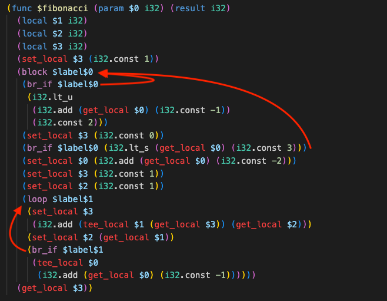

# evm2near quick intro

---

# evm bytecode

```
0x00: PUSH1 0x80
0x02: PUSH1 0x40
0x04: MSTORE
0x05: CALLVALUE
0x06: DUP1
0x07: ISZERO
0x08: PUSH2 0x10
0x0B: JUMPI       --*
0x0C: PUSH1 0x00  <-*
0x0E: DUP1          |
0x0F: REVERT        |
0x10: JUMPDEST    <-*
0x11: POP
0x12: PUSH1 0x40
...
```

---

# WASM

tries to be similar to programming languages control flow, not other low-level asm/bytecodes



---

# (un)structured control flow

<table style="max-width: 100%;">
<tr>
<th> unstructured </br> (any goto-like jump)</th>
<th> structured </th>
</tr>
<tr>
<td>

```
0x00: PUSH1 0x80
0x02: PUSH1 0x40
0x04: MSTORE
0x05: CALLVALUE
0x06: DUP1
0x07: ISZERO
0x08: PUSH2 0x10
0x0B: JUMPI       --*
0x0C: PUSH1 0x00  <-*
0x0E: DUP1          |
0x0F: REVERT        |
0x10: JUMPDEST    <-*
...
```

</td>
<td>


</td>
</tr>
</table>

---


# simplest interpreter

* current position bytecode decoding
* switch statement that chooses appropriate handler and calls it
* handlers for each bytecode operation
  * modifies state
  * returns next bytecode position (to be executed)

---

# translator vs compiler?

* translator
  * converts everything to everything
    * java -> js
    * lisp -> C
    * java bytecode -> .net IL code
    * asm -> native code
    * and even data formats conversion
  * so, compiler is a special case of translator
  * not all translators should be considired compilers
* compiler: source code -> "some executable form":
  * native code (asm <-> native is usually trivially-conversible)
  * VM bytecode (that would be interpreted/JITted/AOT-compiled later)
* **but this is not a rule, and many disagree whether something is a compiler**

---

# what we had at the beginning

sometimes called "interpreter specialized by program":
* we still have "operation handlers" that modify state
* "compiled" program consists of calls to handlers defined by specified evm listing
  * `call(PUSH1)`, `call(DUP2)`, ...
* "handlers" are written in Rust and compiled to wasm module

```wasm
if $I0
  loop $L1
    block $B2
      call $jumpdest
      call $pop
      i32.const 4
      call $push1
      call $calldatasize
      call $lt
      call $_evm_pop_u32
```

---

# what we had at the beginning (part 2)

* due to difference in (un)structured CFG, control flow was implemented naivly:
  * loop is just `call(loop_body)`, so it consumes one stack frame on each iteration
  * to solve that, we needed `relooper`-family algorithm
* overall, it does not differs from interpreted code that much
  * no dispatch code (switch in interpreter case)
  * much more closer to "real compiler", can be gradually improved to be

---

# CFG (control flow graph)

* generated from EVM bytecode
* each node contains set of sequential instructions (basic block)
* edges between nodes -- control flow transfer (`return`, `if`, `loop`, `continue`, `break` + function calls)
* todo image

---

# relooper

* transform loops/conditionals to structured CFG
* wasn't needed before wasm that much
* first mention -- Emscripten (C/C++ -> WASM)
  * theory was there since at least late 80
* requires input CFG to be reducible
* we used "Beyond Relooper" by Norman Ramsey (2022)

---

# (ir)reducible loops


* more than one "header" node
* some nodes should be duplicated to "reduce" graph

---

# first approach: supernodes

* proposed by "Beyond Relooper" paper
* series of graph traversal with two actions:
  * merge: merge two nodes to a single `supernode`
  * split: duplicate one node into two, preserving cfg edges
* can produce HUGE graphs (96 initial nodes -> ~5500 output nodes)

---

# second approach: DJ-graphs

* two main papers:
  * "Handling Irreducible Loops: Optimized Node Splitting vs. DJ-Graphs" by Sebastian Unger and Frank Mueller
  * "Identifying Loops Using DJ Graphs" by Vugranam C. Sreedhar, Guang R. Gao, Yong-Fong Lee
* much more complex algorithm
* produces **much** more compact graphs (96 nodes -> 105 output nodes!)
* took months to implement properly

---

# what else?

* huge bunch of algorithms & data structures around graph manupulation in general and CFG specifically
  * traversals, dominators, node orderings, debug-printing, loop detection, heuristics, ...
* evm bytecode analysis rewritten to match new (more complex) CFG structure
* replaced wasm decode & encode tools (unsupported dependency)
  * `parity-wasm` -> `wasmprinter` + `wasm-encoder` + gule code because WASM ecosystem is garbage
* some kind of CI/CD testing

---

# future work

* switch "operation handlers" to "aurora host functions"
  * depends on `synchronous wasm`
  * would enable cross-contract calls
* move towards "real compiler":
  * rewrite some operation handlers to WASM-native instructions
  * get rid of "virtual EVM stack" and utilize WASM stack directly
    * requires data flow analysis & "register allocation" algorithms
* compiler stabilization (or even having a switch for stable compilation)
* multiple-file compilation model
* function splitting (no matter how many function there are, they are represented by single linear EVM listing)
* of cource, much more testing (we havent even tested memory operations properly!)